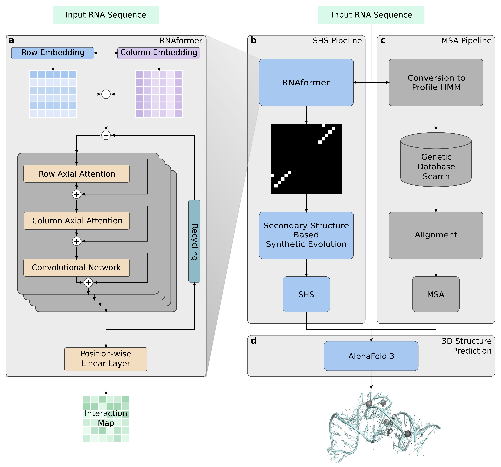

# SyntheticEvolution
Synthetic RNA Homologs Enable Accurate Alignment-Free 3D Structure Prediction

Accurate RNA 3D structure prediction remains a bottleneck in computational biology.
Unlike proteins, most RNAs lack deep multiple sequence alignments (MSAs), limiting the ability of structure prediction methods such as AlphaFold 3 to extract evolutionary constraints.
Here, we address this limitation by generating synthetic homologous sequences instead of searching for natural ones.
Starting from a single RNA sequence, our deep learning model RNAformer predicts secondary structure with high fidelity, which we use to generate structurally consistent synthetic homologs through lightweight, evolution-inspired mutation rules.
This process produces deep, MSA-like sequence ensembles in seconds, without reliance on natural sequence databases.
When supplied to AlphaFold 3, synthetic homologs substantially improve local RNA structural accuracy while largely preserving global fold topology, and rescue predictions for orphan RNAs where no natural alignment exists.
Secondary-structure-guided synthetic homologs thus provide a practical route to accurate RNA 3D structure prediction in regimes where evolutionary information is sparse or absent.


**RNAformer network architecture and workflow for the generation of synthetic homologous sequences.** **a,** *After embedding the input RNA sequence into a 2D latent representation, the RNAformer successively refines this internal representation in subsequent blocks leveraging axial attention layers to finally predict a full nucleotide interaction map.* **b,** *The synthetic homologous sequences (SHS) generation pipeline uses RNAformer to predict an interaction map. The interaction information is subsequently used to inform the generation of SHS.* **c,** *For comparison with our novel SHS approach, we show a (non-iterative) standard pipeline for obtaining MSA using a profile HMM for database mining and subsequent sequence alignment as e.g. used in the HMMER-based genetic search of AlphaFold 3.* **d,** *The generated set of SHS (or the obtained MSA in the case of vanilla AlphaFold 3 predictions) serves as the interaction information for 3D Structure prediction of AlphaFold 3.*

## Install
We use [miniconda](https://www.anaconda.com/docs/getting-started/miniconda/main)/[Micromamba](https://mamba.readthedocs.io/en/latest/installation/micromamba-installation.html) to create a virtual environment for all our dependencies. If you are not familiar with using ```conda``` or ```mamba``` please find more information at <https://www.anaconda.com/docs/getting-started/miniconda/main> and <https://mamba.readthedocs.io/en/latest/index.html>. You can download miniconda for Linux, Windows, and MAC [here](https://www.anaconda.com/download) or read about Micromamba installation [here](https://mamba.readthedocs.io/en/latest/installation/micromamba-installation.html).

Please find detailed guidelines for installation of our pipeline for the generation of synthetic homologues in our [Install Guidelines](/docs/INSTALL.md). 
For quick install, you can use our installation script by running 
```
./install.sh
```
This will install all requirements for the synthetic MSA genration, including downloading RnaBench and SPOT-RNA for structure predictions with SPOT-RNA and RNAfold.
The install script was tested on ```Ubuntu 22.04.5 LTS (Jammy Jellyfish)```.

**Note: Our full prediction pipeline requires AlphaFold 3.**
You can find more guidelines for installation in our [Install Guidelines](/docs/INSTALL.md).

## Data
**Note: Our SHS pipeline works with any AlphaFold 3 json input (data) file for the standalone code version. The AlphaFold 3 server currently does not support custom MSA inputs.**

For reproducing the analysis from our manuscript, we provide all predictions, data files, and processed results for download from stable URLs.

You can download all required files by running
```
./download.sh
```
This will download all data files, predictions, and evaluation ```.csv``` files to reproduce the results of our Nature Biotechnology submission.
**NOTE: The data files archive download is roughly 9GB and extracts to roughly 50GB.**

Alternatively, directly download all predictions, datafiles, and evaluations manually from
```
https://ml.informatik.uni-freiburg.de/research-artifacts/SyntheticEvolution/data.tar.gz
https://ml.informatik.uni-freiburg.de/research-artifacts/SyntheticEvolution/predictions.tar.gz
https://ml.informatik.uni-freiburg.de/research-artifacts/SyntheticEvolution/results.tar.gz
https://ml.informatik.uni-freiburg.de/research-artifacts/SyntheticEvolution/dssr.tar.gz
https://ml.informatik.uni-freiburg.de/research-artifacts/SyntheticEvolution/rnaformer_models.tar.gz
```
and extract them with
```
tar -xzvf <name>.tar.gz
```
Afterwards move them to the correct directories as follows
1. ```predictions``` to ```evaluation```
2. ```dssr``` to ```evaluation```
3. ```models``` (from ```rnaformer_models.tar.gz```) to ```RNAformer```

After this, you should be ready to go.

## Usage
Please find detailed usage instructions in our [Usage Guidelines](docs/USAGE.md).
